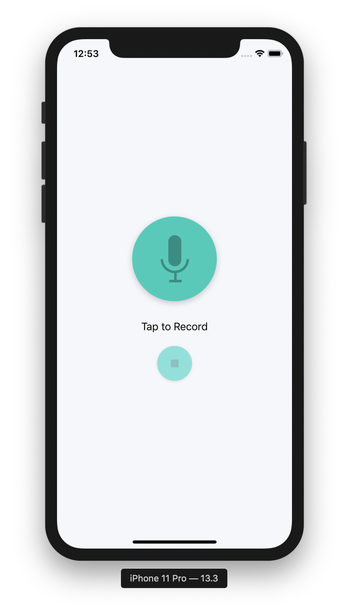
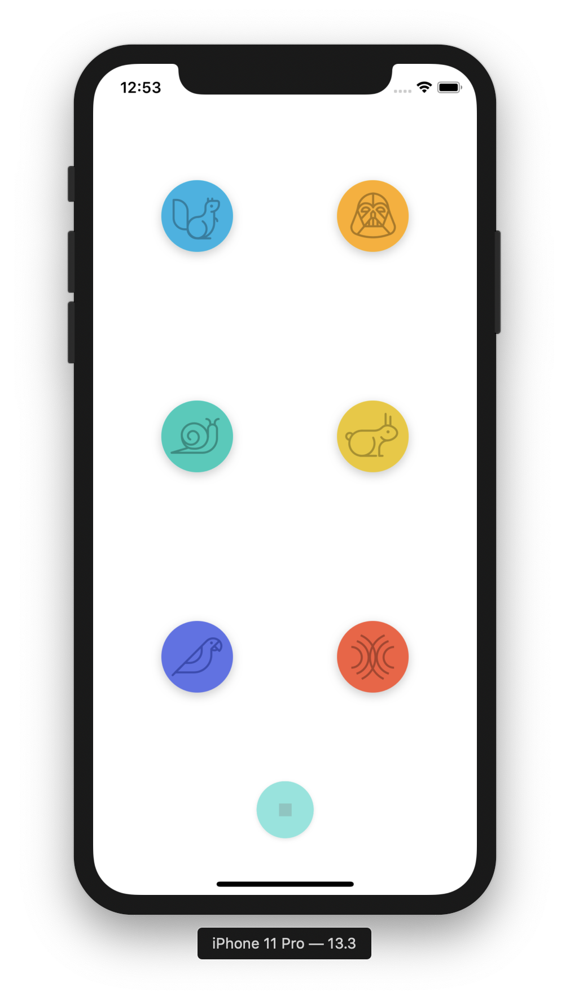

# **VoiceChangeApp, iOS Developer: Elias H.**

**Run instructions:** 
Xcode 10.3/11.3, iPhone XS/11 Pro simulator, 

**Overview:** 
The VoiceChaneApp records the user's voice and plays it back, with a user-chosen sound effect. App uses AVAudioRecorder from AVFoundation. This is recreation of an app called PitchPerfect, with my own developed code.

**Walkthrough:**
**RecordSoundsViewController:** This view controller contains 2 buttons. A recording button and a finished recording button. User taps on the record button, speaks, then taps on the stop recording button. The user is then automatically segued to the PlaySoundsViewController. 

**PlaySoundsViewController:** 
This view controller contains 6 buttons each with its own sound effect. User taps the button to hear their recorded voice played back with button's sound effect. The playback options are: fast, slow, chipmunk, Darth Vader, echo, and reverb. Stop button force-stops the playback. The user can select back in nav bar to return to the recording screen where they can repeat record-playback process.

**PlaySoundsViewController Audio Extention(not written by me):**
Configures UI to be able to playback audio with AVAudioEngine

**Tools used:**
**Xcode 10.3, Swift 4.2, UIKit, AVFoundation**

**Select below for larger clearer images**

